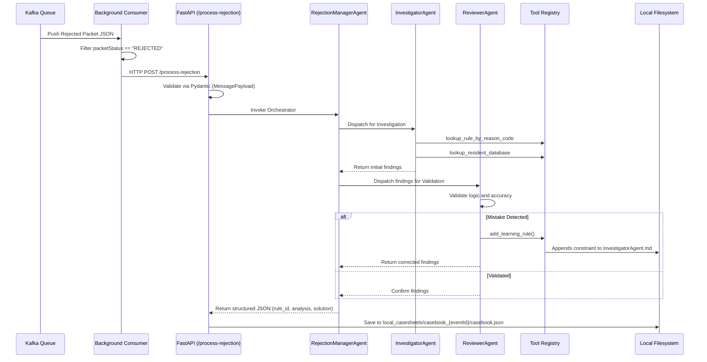

# Packet-CRM: Deep Dive and Architecture

## Overview
**Packet-CRM** is an AI-driven, self-learning service built to ingest, analyze, and resolve rejected biometric packets within the UIDAI ecosystem. 

When a packet fails enrollment or deduplication (e.g., due to a `RESIDENT_MAN_DEDUP_REJECT_TD` error), the system automatically spins up a suite of LangGraph-powered LLM agents. These agents investigate the error against a rules database, validate their findings, permanently learn from their mistakes, and format the output into structured JSON casebooks.

---

## 1. High-Level Workflow



---

## 2. Directory Structure

The repository follows standard Python backend architecture for modularity and scalability:

```text
packet-CRM/
├── src/
│   ├── main.py                     # App entry point, daemon lifecycle manager
│   ├── api/
│   │   └── routes.py               # REST endpoints (/process-rejection)
│   ├── core/
│   │   └── agent_orchestrator.py   # LangGraph initialization and LLM provisioning
│   ├── models/
│   │   └── schemas.py              # Strict Pydantic data validation schemas
│   ├── prompts/                    
│   │   ├── manager.md              # RejectionManager orchestration logic
│   │   ├── InvestigatorAgent.md    # Investigator context and instructions
│   │   └── ReviewerAgent.md        # Reviewer context and validation logic
│   ├── config/                     
│   │   └── agents.json             # Map of Subagents to their prompts and tools
│   ├── tools/
│   │   └── tool_registry.py        # Custom Python tools (DB lookup, self-learning)
│   └── utils/
│       ├── env.py                  # Environment variable configuration
│       ├── kafkaConsumer.py        # Background topic polling
│       ├── llm_utils.py            # Local LLM and HF model factory
│       └── s3_client.py            # (Disabled) Cloud storage integrations
```

---

## 3. Core Components Deep Dive

### 3.1 Environment & Local LLM Integration (`llm_utils.py`)
Unlike generic AI projects bound to OpenAI, `packet-CRM` is designed for on-premise, secure environments. 
The `get_llm(tier="complex")` factory dynamic routes requests to custom, locally hosted models via `LLM_BASE_URL_COMPLEX` (e.g., `http://localhost:8000/v1`). 
Additionally, it provides a seamless fallback to free Hugging Face endpoints by simply toggling the `USE_HF=true` environment variable.

### 3.2 The Pipeline (`agent_orchestrator.py` & `routes.py`)
Incoming payloads are rigorously validated using Pydantic schemas in `routes.py`. Once parsed, the `agent_orchestrator` dynamically initializes the LangGraph graph using the `deepagents` SDK. The orchestrator maps the `agents.json` configuration to physical markdown files in the `prompts/` directory.

### 3.3 The Agent Ecosystem
The intelligence of the system relies on a multi-agent hierarchy:
- **RejectionManagerAgent**: The conductor. It reads the payload and coordinates a strict two-step pipeline. It cannot solve problems itself.
- **InvestigatorAgent**: The detective. It actively queries databases to correlate error codes (`reasonCode`) with internal business rules (`ruleId`).
- **ReviewerAgent**: The auditor. It checks the Investigator's homework to eliminate hallucinations.

### 3.4 The Self-Learning Loop (`tool_registry.py`)
If the `ReviewerAgent` spots a mistake (e.g., the Investigator recommended a solution that contradicts the business rule), the Reviewer invokes the `add_learning_rule` tool.
This tool programmatically opens `src/prompts/InvestigatorAgent.md` and permanently writes a new `- CRITICAL RULE:` constraint to the file. This ensures the system perpetually improves its accuracy on future runs without requiring manual developer intervention.

### 3.5 Storage & Casesheets
Outputs are stored in `local_casesheets/casebook_<event_id>/casebook.json`. The output is guaranteed to be a highly structured JSON block containing:
- `rule_id`
- `reason_code`
- `analysis`
- `solution`
This clean data structure is immediately ready for downstream analytical engines.

---

## 4. How to Run Locally

1. **Install Dependencies:**
   ```bash
   python3 -m venv .venv
   source .venv/bin/activate
   pip install -r requirements.txt
   ```

2. **Configuration:**
   Ensure environment variables like `USE_MOCK_DB=true` and `LLM_BASE_URL_COMPLEX` are configured.

3. **Start the Server:**
   ```bash
   python3 src/main.py
   ```
   *Note: This starts both the FastAPI server on port 8000 and the daemon Kafka consumer.*

4. **Testing Pipeline (No Kafka Required):**
   ```bash
   python3 test_payload.py
   ```
   *This statically parses a mock Kafka payload through the Pydantic models to ensure validation logic is intact.*
