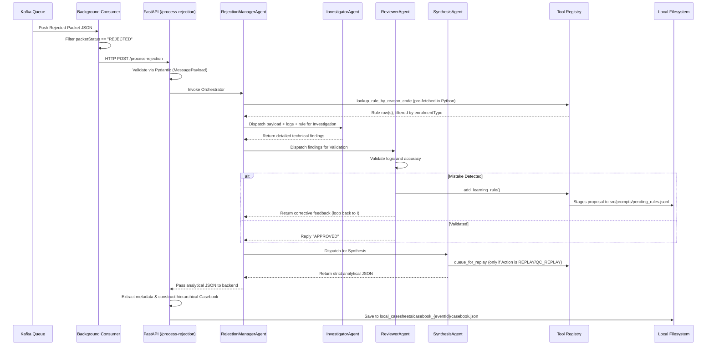

# Packet-CRM: Deep Dive and Architecture

## Overview
**Packet-CRM** is an AI-driven, self-learning service built to ingest, analyze, and resolve rejected biometric packets within the UIDAI ecosystem. 

When a packet fails enrollment or deduplication (e.g., due to a `RESIDENT_MAN_DEDUP_REJECT_TD` error), the system automatically spins up a suite of LangGraph-powered LLM agents. These agents investigate the error against a rules database, validate their findings, permanently learn from their mistakes, and format the output into structured JSON casebooks.

---

## 1. High-Level Workflow



---

## 2. Directory Structure

The repository follows standard Python backend architecture for modularity and scalability:

```text
packet-CRM/
├── .agents/
│   └── AGENTS.md                   # Agentic configurations and behavioral rules
├── agent_policy_context.md         # Foundational business logic & rules mapping for AI agents
├── start.py                        # Process supervisor: spawns main_api.py + main_consumer.py
├── local_run.py                    # CLI: POST a local packet JSON to the running API
├── test_payload.py                 # Static Pydantic validation smoke test
├── rules.csv                       # Rules export used by check_drift.py
├── tests/
│   └── test_resilience.py          # Resilience/idempotency/DLQ regression tests
├── src/
│   ├── main_api.py                 # FastAPI entry point (uvicorn, port 8000)
│   ├── main_consumer.py            # Kafka consumer entry point (separate process)
│   ├── api/
│   │   └── routes.py               # REST endpoints (/process-rejection, /health, /ready)
│   ├── core/
│   │   └── agent_orchestrator.py   # LangGraph StateGraph build + LLM provisioning
│   ├── models/
│   │   └── schemas.py              # Strict Pydantic data validation schemas
│   ├── prompts/
│   │   ├── InvestigatorAgent.md    # Investigator context and instructions
│   │   ├── ReviewerAgent.md        # Reviewer context and validation logic
│   │   ├── SynthesisAgent.md       # Synthesis output contract (strict JSON keys)
│   │   └── pending_rules.jsonl     # Staged self-learning proposals (human-gated)
│   ├── storage/
│   │   ├── base.py                 # CasebookStorage Protocol
│   │   ├── local.py                # Atomic .tmp + filelock local filesystem backend
│   │   ├── s3.py                   # S3 backend (stub, NotImplementedError)
│   │   └── factory.py              # Backend selection via CASEBOOK_STORAGE_BACKEND
│   ├── db/
│   │   └── pending_replays.jsonl   # Human-in-the-loop replay queue
│   ├── tools/
│   │   ├── tool_registry.py        # Custom Python tools (DB lookup, logs, replay queue)
│   │   ├── approve_replays.py      # CLI script for humans to approve packet replays
│   │   ├── promote_rules.py        # CLI script to promote + git-commit learned rules
│   │   ├── check_drift.py          # rules.csv schema drift detector
│   │   ├── build_catalog.py        # Stage 0: Offline template catalog builder
│   │   ├── eval_harness.py         # Stage 6: Evaluation harness for pipeline accuracy
│   │   └── prune_checkpoints.py    # SQLite checkpoint pruning utility
│   ├── log_pipeline/
│   │   ├── config.py               # Pipeline constants and tunables
│   │   ├── catalog.py              # Stage 0: Template classification catalog
│   │   ├── fetcher.py              # Stage 1: Source-filtered ES fetch + search_after
│   │   ├── reducer.py              # Stages 2-4: ERROR branch, Drain3 clustering, guardrails
│   │   └── pipeline.py             # Top-level orchestrator wiring Stages 1-4
│   └── utils/
│       ├── env.py                  # Environment variable configuration
│       ├── config_validator.py     # Fail-fast boot-time configuration validation
│       ├── logging_config.py       # structlog JSON logging setup
│       ├── kafkaConsumer.py        # Background topic polling + bounded worker pool
│       ├── llm_utils.py            # LLM factory (local OpenAI-compatible / Mistral / HF)
│       ├── resilience.py           # tenacity retries + pybreaker circuit breakers
│       ├── dlq_publisher.py        # Dead Letter Queue producer
│       └── s3_uploader.py          # Uploads large Elastic logs to S3
├── local_casesheets/               # Generated: casebook_<eventId>/{casebook,status}.json, logs
└── local_checkpoints/              # Generated: consumer heartbeat, drain3 state, catalog
```

> Note: the LangGraph SQLite checkpoint file is currently written to `src/checkpoints.db`,
> while `/ready` and `prune_checkpoints.py` look for it under `local_checkpoints/`.
> See section 5 (Known Gaps).

---

## 3. Core Components Deep Dive

### 3.1 Environment Configuration (`.env`)
The system manages all operational feature flags, LLM credentials, MySQL database connections, and Kafka connectivity settings via a strictly typed `.env` file (loaded via `python-dotenv` in `src/utils/env.py`).
- **Template:** A reference file containing all placeholders is available at `.env.example`.
- **Database Modes:** Set `USE_MOCK_DB=true` to parse rules locally from a CSV, or `USE_MOCK_DB=false` to dynamically query the live MySQL `rules` table via SQLAlchemy/PyMySQL.
- **Security:** The actual `.env` file is excluded via `.gitignore` to prevent secret leakage.

### 3.2 Environment & Local LLM Integration (`llm_utils.py`)
Unlike generic AI projects bound to OpenAI, `packet-CRM` is designed for on-premise, secure environments.
`get_llm(tier)` is a three-way factory selected by environment flags, in priority order:
1. `USE_HF=true` -> `ChatHuggingFace` over `HuggingFaceEndpoint` (requires `HF_TOKEN`).
2. `MOCK_LLM_WITH_MISTRAL=true` -> `ChatMistralAI` (development/demo path, requires `langchain-mistralai`).
3. Default -> `ChatOpenAI` pointed at an OpenAI-compatible local endpoint via `LLM_BASE_URL_COMPLEX` (e.g. `http://localhost:8000/v1`).

The factory accepts `tier="complex"` and `tier="simple"` and raises `ValueError`
on any other tier. The Investigator and Synthesis agents use `complex`; the
Reviewer -- a bounded verdict task -- uses the cheaper `simple` tier, so both
tiers are now load-bearing rather than one being constructed and discarded.
`.env`, `.env.example`, and `llm_utils.py` all use this same
`_COMPLEX`/`_SIMPLE` env var suffix vocabulary; `config_validator.py` checks
whichever key the *selected* provider (`USE_HF` / `MOCK_LLM_WITH_MISTRAL` /
default OpenAI-compatible) actually reads, not a hardcoded `OPENAI_API_KEY`.

### 3.3 Core Pipeline (Deterministic StateGraph)
Instead of relying on an unpredictable LLM to orchestrate the subagents, the system uses a highly robust, strictly deterministic Python `StateGraph` (via `langgraph`) in `src/core/agent_orchestrator.py`. This ensures the exact sequential execution of every step.

1. **Log Fetcher Node**: (If `ENABLE_LOG_FETCHING=true`) Automatically triggers the `fetch_elastic_logs` tool to pull relevant Kibana traces using the `eventId`.
2. **Investigator Node**: A React agent constructed with an **empty tool list**. All external lookups are performed deterministically in Python before the call: `lookup_rule_by_reason_code` is invoked by the node itself, the result is filtered by `enrolmentType`, and the rule text is injected into the prompt. This removes a whole class of tool-call hallucination and redundant DB round-trips. The prompt is projected down to only the fields the Investigator needs (`eventId`, `packetMetaData`, `packetExecutionSummary`, `flowMetaData.stage`) rather than the full raw Kafka message, and on a retry it sends only the delta -- the prior investigation plus the Reviewer's feedback -- instead of resending the full payload/logs/rule context again.
3. **Reviewer Node**: A distinct React agent, built once at graph-construction time (not per review) and bound to the `simple` LLM tier, that acts as a strict QC validator holding one tool (`add_learning_rule`). The tool no longer closes over the current `event_id`/investigation text per call -- it reads them from a pair of `contextvars.ContextVar`s that `reviewer_node` sets before each invocation, since each packet already runs on its own dedicated thread.
4. **Conditional Router & Loop Guard**: A pure Python control edge that checks the Reviewer's output via `is_reviewer_approved()`: the (markdown/whitespace-stripped) feedback must *start with* the literal token `APPROVED`, not merely contain it -- this closes the "NOT APPROVED"/"DISAPPROVED" false-positive that a substring match would produce. Otherwise it increments `retry_count`; once `retry_count >= MAX_INVESTIGATION_RETRIES` it routes to the `escalate` node (preventing infinite LLM loops), else it loops back to the Investigator Node. A fresh (non-resumed) invocation always starts `retry_count` at 0, so a redelivered packet can never resume a stale checkpoint with the retry budget already exhausted.
5. **Synthesis Node**: The final agent that takes the approved, heavily vetted technical diagnosis and translates it into a human-readable JSON `Casebook`. It holds the `queue_for_replay` tool.
6. **Log Processor & S3 Uploader**: After the graph completes, `routes.py` evaluates the reduced log text carried in graph state. Text under 5000 characters is embedded directly into the casebook `packet_status.rejection_data.rejection_logs` field. Larger payloads are uploaded to AWS S3 via `boto3` (`src/utils/s3_uploader.py`), and the resulting `s3://...` URL is embedded instead. `upload_logs_to_s3()` returns `None` (never a fake URL) when `S3_LOGS_BUCKET` is unset or the upload fails; `routes.py` then embeds a truncated copy of the log text inline instead of silently discarding the evidence behind a placeholder URL.

### 3.4 Resilience & Hardening (Phase 1 & 2)
The architecture incorporates several resilience mechanisms to prevent runaway costs, silent failures, file corruption, and pipeline deadlocks:
- **Idempotency & Staleness Guards**: The API intercepts requests and validates against the `CasebookStorage` interface. `IN_PROGRESS` stubs are written immediately to a separate `status.json` file to prevent duplicate runs without polluting the final `casebook.json`. Upon successful completion, `status.json` is overwritten with the terminal status. If an `IN_PROGRESS` stub goes stale (exceeding `MAX_IN_PROGRESS_AGE_SECONDS`), the pipeline safely resumes from a LangGraph checkpoint or fresh start. Terminal statuses include `COMPLETED`, `REJECTED`, `NEEDS_MANUAL_REVIEW`, `FAILED_PERMANENT`, `DLQ`, and `FAILED_TIMEOUT`.
- **6-Stage Log Reduction Pipeline (`src/log_pipeline/`)**: Elasticsearch logs are no longer dumped raw into the LLM context. Instead, they pass through a production-grade pipeline: Stage 1 (source-filtered fetch with `search_after` and an `_id` tiebreaker for broad ES version compatibility, a hard `LOG_MAX_DOCUMENTS` cap, TLS verification on by default (`ES_VERIFY_CERTS`), and local Kibana CSV mock support via `ES_MOCK_FILE` for offline testing), Stage 2 (branch on ERROR -- stuck packets skip clustering, with both a leading *and* trailing context window so a cascading failure can't pull in the entire trace), Stage 3 (Drain3 clustering with file-persisted state for stable template IDs, held as a process-wide `TemplateMiner` singleton so the state file is only read/deserialized once per process rather than per packet, serialized by a thread lock + cross-process `FileLock` so concurrent packets can't corrupt the shared parse tree, and scoped to emit only the clusters this call's own logs actually matched -- never another packet's templates), and Stage 4 (evidence assembly guardrails enforcing decision-vocabulary regex matches, rare-template retention, and flow-boundary context). An offline Stage 0 catalog (`build_catalog.py`) classifies templates as boilerplate/informative/decision-marker and flags an implausibly high boilerplate share, and a Stage 6 eval harness (`eval_harness.py`) validates pipeline accuracy before production use.
- **Pluggable Log Sources (`src/log_pipeline/sources/`)**: Stage 1 sits behind a `LogSource` Protocol (mirroring `CasebookStorage`), so Stages 2-4 are source-agnostic -- any source emitting the canonical `LogRecord` (`timestamp`/`level`/`message`/`app_name`, defined in `src/log_pipeline/types.py`) works with Drain3 clustering, the guardrails, the S3 offload, and the casebook wiring unchanged. `ElasticLogSource` wraps the existing fetcher without modifying it, so the `ES_MOCK_FILE` CSV workflow is unchanged. A `KubernetesLogSource` that reads pod logs directly via the Kubernetes API is under construction (`sources/k8s/`) to cover cases where Elasticsearch has dropped lines; it returns evidence gaps (log rotation, replaced pods, truncation) as first-class data so the agents are told when a trace is incomplete rather than silently reasoning over a partial picture. **Elasticsearch remains the primary source and the system of record; the Kubernetes source is supplementary.** `LOG_SOURCE` is an ordered fallback chain (`elastic` by default, so behaviour is unchanged until an operator opts in; `kubernetes,elastic` tries pods first and falls back). Fallback triggers when a source fails *or* returns no records; sources are never merged, one wins per fetch, and a `SOURCE_FALLBACK` note records what was tried. The Kubernetes source redacts PII before anything is persisted, retries per HTTP status (never a 403), bounds the whole fan-out with a wall-clock deadline, and snapshots its first successful capture to `raw_logs_k8s.jsonl` so retries, DLQ replays, and checkpoint resumes reuse evidence that the kubelet has since discarded. Evidence gaps are rendered as a banner ahead of the trace so the agents see that a trace is incomplete before they read it. See `KUBERNETES_LOGS_PLAN.md`.
- **Decoupled Consumer & Bounded Concurrency**: `main_consumer.py` isolates the Kafka polling loop and submits tasks to a `ThreadPoolExecutor` bounded by a `Semaphore` (`MAX_CONCURRENT_INVESTIGATIONS`). Offsets are committed per-message (not per-batch) immediately upon enqueuing, and the semaphore is only released once, tracked via an explicit `submitted` flag so a `commit()` failure after a successful `submit()` can't double-release it.
- **DLQ, Poison-pill, & Checkpointing**: LangGraph uses `SqliteSaver` (with WAL mode enabled) for scalable crash recovery. Structurally invalid Kafka messages (poison-pills) and unrecoverable pipeline crashes are immediately published to a Dead Letter Queue (`rejected-packets-dlq`) via `dlq_publisher.py`.
- **Pipeline Timeouts**: `PACKET_TIMEOUT_SECONDS` bounds the **consumer-side HTTP client** in `kafkaConsumer.py`. The API side is independently bounded too: `routes.py` runs `agent.invoke()` on a dedicated executor thread with its own budget (`AGENT_INVOKE_TIMEOUT_SECONDS`, defaulting to `PACKET_TIMEOUT_SECONDS - 30s`) so the server is authoritative about its own failure and returns `FAILED_TIMEOUT` before the consumer's deadline fires. Both the LLM clients (`LLM_TIMEOUT_SECONDS`, `max_retries=0`) and `agent.invoke` are bounded. If a terminal `FAILED_TIMEOUT`/`DLQ` status is already recorded by the time a slow invocation finally returns, that late result is discarded rather than overwriting it.
- **Human-in-the-Loop Replays**: Agents cannot fire destructive API requests directly. Unless `ENABLE_AUTO_REPLAY=true`, replay actions invoked by the LLM are queued to `src/db/pending_replays.jsonl` under a `filelock` and require an operator to approve via `approve_replays.py`. Both the auto-replay call and `approve_replays.py` send the replay payload as an authenticated (`OIS_API_KEY`) JSON body rather than query params, so PII like `notificationEmail`/`notificationMobile` doesn't land in server access logs. `approve_replays.py` re-reads the queue file fresh before its final rewrite so replays queued mid-review by a live investigation aren't erased.
- **Safe Self-Learning & Drift Checks**: The Reviewer's `add_learning_rule` tool stages suggestions to `src/prompts/pending_rules.jsonl` using `filelock`. A human runs `src/tools/promote_rules.py` (which includes top-level locking and git-status safety checks) to approve and Git-commit the rules; only promoted entries are removed from the pending file, so skipped/errored/concurrently-appended entries survive. Additionally, `src/tools/check_drift.py` detects database schema/policy drift, and distinguishes a genuinely changed schema from a malformed single-column CSV export.
- **External Call Resilience**: `tenacity` handles exponential backoff retries, and `pybreaker` provides circuit breakers for database, Elasticsearch, and LLM calls.
- **Storage Abstraction & Schema Versioning**: The `CasebookStorage` interface implements atomic `.tmp` writes and enforces a `"schema_version"` field on every saved casebook for backwards compatibility.
- **Structured Logging & Health Checks**: `agent_orchestrator.py`, `tool_registry.py`, and the entire `log_pipeline/` package log through the same `structlog` logger as `routes.py` (bound to `event_id` where available) rather than bare `print()`. The FastAPI server provides `/health` (monitoring consumer heartbeats) and `/ready` (verifying SQLite and Kafka producer connectivity) endpoints; the Kafka producer check is cached for `PRODUCER_HEALTH_TTL_SECONDS` (default 30s) so a burst of readiness probes can't each force a fresh broker connection attempt. `validate_config()` provides fail-fast configuration validation at boot.
- **Agent Caching**: Investigator, Synthesis, and Reviewer React agents are all created once at graph construction time and reused across invocations, avoiding per-packet (and, for the Reviewer, per-retry) LLM handshake overhead.
- **Non-Blocking Request Handling**: `/process-rejection` is `async def`; `agent.invoke()` runs on a dedicated `ThreadPoolExecutor` sized to `MAX_CONCURRENT_INVESTIGATIONS`, separate from Starlette's own sync-dispatch threadpool. A multi-minute investigation therefore can't starve `/health`, `/ready`, or the sync auth/rate-limit dependencies of a worker slot.
- **Indexed Mock Rule Lookups**: `lookup_rule_by_reason_code` builds a `reason_code -> row positions` index over the mock rules table once (cached for the process lifetime) instead of rescanning and re-casting every row on every lookup; a missing/unreadable mock DB file is also cached so the filesystem isn't re-probed on every call.
- **Rate Limiter Eviction**: The in-memory IP rate limiter evicts stale entries when it exceeds 1000 tracked IPs to prevent unbounded memory growth.

### 3.5 The Agent Ecosystem
The intelligence of the system relies on a multi-agent hierarchy. Both the Investigator and Synthesis agents are strictly instructed to reference the business logic outlined in `agent_policy_context.md` to understand success criteria and parse deviations correctly.
- **Dynamic Context Injection**: The Python orchestrator dynamically intercepts and filters database rules (e.g., checking the `enrolmentType` from the payload) before injecting the exact correct rule into the agent's prompt to avoid LLM hallucinations.
- **RejectionManager (not an LLM)**: The conductor is the compiled `StateGraph` itself, not an agent. Routing is plain Python, so the sequence of steps cannot be altered by a model.
- **InvestigatorAgent**: The detective. It correlates error codes (`reasonCode`) with the internal business rule (`ruleId`) that the orchestrator pre-fetched for it, cross-references the reduced Elasticsearch trace, and determines the technical failure. It holds no tools of its own.
- **ReviewerAgent**: The auditor. It checks the Investigator's homework to eliminate hallucinations.
- **SynthesisAgent**: The resolution writer. Once the investigation is validated, this agent synthesizes the findings into plain English, categorizes the remediation steps into strict enums (e.g., `NEW_PACKET`, `REPLAY`), and generates the analytical JSON block.

### 3.6 6-Stage Log Reduction Pipeline
Elasticsearch logs are heavily compressed to prevent LLM context window exhaustion and save tokens, using a production-grade map-reduce and clustering architecture (`src/log_pipeline/`):
- **Stage 0 (Offline Catalog)**: `build_catalog.py` samples historical logs to identify structural templates, classifying them as `boilerplate`, `informative`, or `decision-marker` based on cross-flow frequency.
- **Stage 1 (Fetch)**: Source-filters Elastic logs to minimal fields, uses `search_after` with `_seq_no` for stable pagination, and uses catalog-driven `must_not` filters to drop pure boilerplate.
- **Stage 2 (ERROR Branching)**: Instantly detects `level=ERROR` logs. If found, it trims the trace to the exact error plus a 200-line preceding context window, bypassing clustering entirely to preserve raw crash forensics.
- **Stage 3 (Drain3 Clustering)**: For non-crashing (logic/rule rejection) flows, it uses Drain3 to strip dynamic noise (UUIDs, IPs) and cluster identical logs into structural templates. Clustering state is file-persisted to keep template IDs stable.
- **Stage 4 (Evidence Guardrails)**: Regardless of clustering, it forces full-text retention for matches against a decision-vocabulary regex (e.g., `Validation Failed`), rare templates (count < 5), and flow boundaries.
- **Stage 5 & 6 (LLM & Eval)**: The heavily compressed, structured output is injected into the LLM context (and simultaneously persisted to `reduced_logs.txt` for human audits). `eval_harness.py` provides an offline safety check to measure evidence-citation accuracy against ground truth before trusting the pipeline in production.

### 3.7 The Self-Learning Loop (human-gated)
If the `ReviewerAgent` spots a mistake (e.g., the Investigator recommended a solution that contradicts the business rule), the Reviewer invokes the `add_learning_rule` tool, defined inline in `agent_orchestrator.reviewer_node`.

The tool does **not** mutate any prompt directly. It appends a JSON proposal
(`eventId`, timestamp, proposed rule, reviewer reasoning, original investigator output)
to `src/prompts/pending_rules.jsonl` under a `filelock`. A human then runs
`src/tools/promote_rules.py`, which refuses to run if `src/prompts/` has uncommitted
changes, prompts per rule, appends approved ones to `src/prompts/InvestigatorAgent.md`
as `- CRITICAL RULE:` lines, and Git-commits each promotion. This keeps the learning
loop auditable and prevents an LLM from silently rewriting its own instructions.

### 3.8 Storage & Casesheets
Outputs are stored in `local_casesheets/casebook_<event_id>/`. This directory contains:
- `casebook.json`: The final structured JSON block (terminal state only).
- `status.json`: The in-flight lifecycle marker (`IN_PROGRESS`, then the terminal status).
- `raw_logs.txt`: The complete uncompressed Elasticsearch log trace.
- `reduced_logs.txt`: The heavily compressed logs that were injected into the LLM.
- `*.lock` / `*.tmp`: `filelock` and atomic-write scratch files.

`eventId` is constrained by a Pydantic pattern (`^[A-Za-z0-9_.:-]{1,128}$`) before
it is ever interpolated into a path, and `LocalFilesystemCasebookStorage`
independently refuses to resolve a directory outside its storage root as
defense in depth. Only `save()` creates a casebook directory as a side
effect -- `load()`/`exists()` are read-only and never create one, so probing
for an event that doesn't exist (or was skipped) doesn't leave an empty
directory behind.

To ensure zero hallucinations, `routes.py` deterministically extracts static metadata directly from the Kafka payload. All keys are `snake_case`. The output is a hierarchical JSON block formatted for downstream systems:
- **packet_metadata** (`srn`, `eid`, `ref_id`, `source`, `packet_type`, `created_at`, ...)
- **packet_status** (`status`, `service`, `sub_service`, `rejection_data`)
- **resolution** (Generated by the `SynthesisAgent`: `synthesis`, `action`, `resident_action`)
- **schema_version** (injected by the storage layer, currently `"1.1"`)

`packet_metadata.is_mbu`, `update_type`, and `is_child` are currently emitted as `null`
because the mapping is not derivable from the payload alone.

### 3.9 Runbook Pipeline
For repeated rejections, the system implements a Runbook pattern to short-circuit the multi-minute LLM loop.
- **Drafting (Offline)**: `build_runbooks.py` mines `local_casesheets/` for completed resolutions sharing the same `errorReasonCode` and `enrolmentType`. It uses a strictly prompted LLM (the `simple` tier) to synthesize a generic resolution template that contains zero packet-specific values (enforced by a regex validator checking for UUIDs, dates, SRNs, etc.). The result is saved to `src/runbooks/draft/`.
- **Promotion (Offline)**: `promote_runbooks.py` acts as a human review gate. Operators inspect the generic template and approve it. The tool checks for rule fingerprint staleness, bumps the version, and git-commits the final template to `src/runbooks/final/`.
- **Serving (Online)**: A `runbook_lookup` node runs immediately after `fetch_logs`. If `RUNBOOK_MODE=serve` and a final runbook matches the current packet's reason code (with the `rule_fingerprint` matching the live DB rule), the graph short-circuits the agents and directly emits the runbook's generic resolution. To preserve auditability, `resolution.source` in the casebook is marked with `runbook:<id>@v<version>`. If `RUNBOOK_MODE=shadow`, the agents still run and any divergence is logged.

---

## 4. How to Run Locally

1. **Install Dependencies:**
   **Mac/Linux:**
   ```bash
   python3 -m venv .venv
   source .venv/bin/activate
   pip install -r requirements.txt
   ```

   **Windows (Command Prompt):**
   ```cmd
   python -m venv .venv
   .venv\Scripts\activate.bat
   pip install -r requirements.txt
   ```

   **Windows (PowerShell):**
   ```powershell
   python -m venv .venv
   .venv\Scripts\Activate.ps1
   pip install -r requirements.txt
   ```

2. **Configuration:**
   Copy `.env.example` to `.env` and set at minimum `USE_MOCK_DB`, `MOCK_DB_PATH`,
   `LLM_BASE_URL_COMPLEX` / `LLM_MODEL_COMPLEX`, and `PACKET_CRM_API_KEY`.
   For fully offline runs, set `ES_MOCK_FILE` to a Kibana CSV export.

3. **Start both services:**
   ```bash
   python3 start.py
   ```
   *This supervisor spawns `src/main_api.py` (FastAPI on port 8000) and
   `src/main_consumer.py` (Kafka consumer) as two separate processes.*

   To run them individually:
   ```bash
   python3 src/main_api.py        # API only
   python3 src/main_consumer.py   # Consumer only
   ```

### 4.2 API Documentation (Swagger UI)
Because the application is built on FastAPI with populated metadata, interactive API documentation is automatically generated.
- Navigate to `http://localhost:8000/docs` to view the Swagger UI.
- Here you can see the fully expanded `MessagePayload` schema (including optional fields like `flowMetaData`, `resubmissionSummary`, etc.) and test the `/process-rejection` endpoint directly from your browser.

4. **Testing Pipeline (No Kafka Required):**
   ```bash
   python3 test_payload.py                 # static Pydantic validation smoke test
   python3 local_run.py path/to/packet.json # POST a real packet to a running API
   python3 -m pytest tests/ -q             # resilience regression suite
   ```

### 4.3 Operator CLIs
```bash
python3 -m src.tools.promote_rules       # review + git-commit staged learning rules
python3 -m src.tools.approve_replays     # approve queued packet replays
python3 -m src.tools.check_drift         # detect rules.csv schema drift
python3 -m src.tools.prune_checkpoints --dry-run
python3 -m src.tools.build_catalog --refids-file refids.txt
python3 -m src.tools.eval_harness --test-cases test_cases.json
```

---

## 5. Known Gaps & Deviations

This section records where the running code diverges from the design intent above.
It is maintained deliberately so the document stays a truthful source of truth.

The Phase 0 (correctness-breaking, P0), Phase 1 (reliability/operability, P1),
and Phase 2 (optimization, P2) items from the remediation plan
(`REMEDIATION_PLAN.md`) have all been implemented, covered by
`tests/test_phase0_fixes.py`, `tests/test_phase1_fixes.py`, and
`tests/test_phase2_fixes.py` respectively -- with one deliberate exception (2.9,
below). What remains:

| # | Area | Gap |
|---|------|-----|
| 1 | `rules.csv` data quality | The checked-in `rules.csv` parses as a single garbled column (416 rows, all under a lone `rule_id` header) -- almost certainly an export with unescaped commas/newlines inside `rule_data`'s JSON. `check_drift.py` now detects and reports this distinctly from a genuine schema change, but the file itself still needs a proper re-export from the source DB; no code change can fix corrupted source data. |
| 2 | Template catalog not yet rebuilt | `build_catalog.py` no longer inherits the Drain3 cross-flow leak (fixed at the source in `reducer.cluster_logs`), and now warns if the boilerplate share of a build is implausibly high, but this requires live ES access to real event IDs to actually run -- no catalog has been (re)built under the fixed pipeline yet. |
| 3 | Rate limiter eviction strategy (Phase 2, 2.9) | `routes.py`'s in-memory rate limiter still scans all tracked IPs with a `max()` per entry once past 1000 entries. Left as-is deliberately -- the remediation plan itself notes this is cheap at current request volume, and recommends revisiting with a per-IP `deque` only if that volume grows; not a currently-observable problem. |

See `REMEDIATION_PLAN.md` for the full historical audit this table tracks against.
