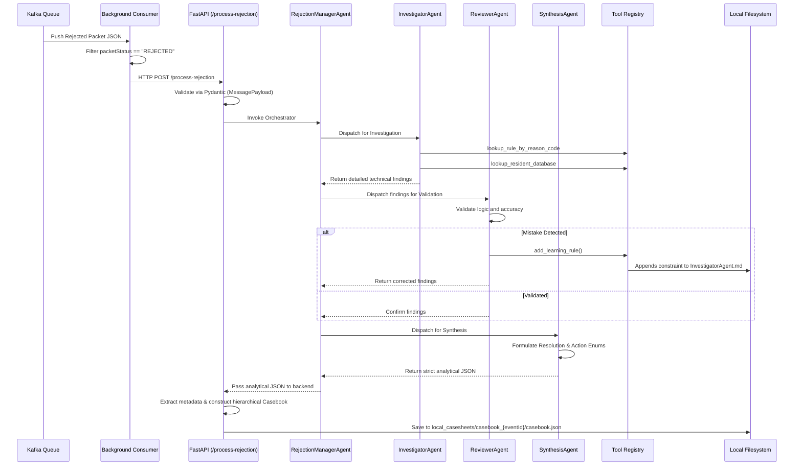

# Packet-CRM: Deep Dive and Architecture

## Overview
**Packet-CRM** is an AI-driven, self-learning service built to ingest, analyze, and resolve rejected biometric packets within the UIDAI ecosystem. 

When a packet fails enrollment or deduplication (e.g., due to a `RESIDENT_MAN_DEDUP_REJECT_TD` error), the system automatically spins up a suite of LangGraph-powered LLM agents. These agents investigate the error against a rules database, validate their findings, permanently learn from their mistakes, and format the output into structured JSON casebooks.

---

## 1. High-Level Workflow



---

## 2. Directory Structure

The repository follows standard Python backend architecture for modularity and scalability:

```text
packet-CRM/
├── .agents/                        
│   └── AGENTS.md                   # Agentic configurations and behavioral rules
├── agent_policy_context.md         # Foundational business logic & rules mapping for AI agents
├── src/
│   ├── main.py                     # App entry point, daemon lifecycle manager
│   ├── api/
│   │   └── routes.py               # REST endpoints (/process-rejection)
│   ├── core/
│   │   └── agent_orchestrator.py   # LangGraph initialization and LLM provisioning
│   ├── models/
│   │   └── schemas.py              # Strict Pydantic data validation schemas
│   ├── prompts/                    
│   │   ├── manager.md              # RejectionManager orchestration logic
│   │   ├── InvestigatorAgent.md    # Investigator context and instructions
│   │   └── ReviewerAgent.md        # Reviewer context and validation logic
│   ├── config/                     
│   │   └── agents.json             # Map of Subagents to their prompts and tools
│   ├── tools/
│   │   └── tool_registry.py        # Custom Python tools (DB lookup, self-learning)
│   └── utils/
│       ├── env.py                  # Environment variable configuration
│       ├── kafkaConsumer.py        # Background topic polling
│       ├── llm_utils.py            # Local LLM and HF model factory
│       └── s3_client.py            # (Disabled) Cloud storage integrations
```

---

## 3. Core Components Deep Dive

### 3.1 Environment Configuration (`.env`)
The system manages all operational feature flags, LLM credentials, MySQL database connections, and Kafka connectivity settings via a strictly typed `.env` file (loaded via `python-dotenv` in `src/utils/env.py`).
- **Template:** A reference file containing all placeholders is available at `.env.example`.
- **Database Modes:** Set `USE_MOCK_DB=true` to parse rules locally from a CSV, or `USE_MOCK_DB=false` to dynamically query the live MySQL `rules` table via SQLAlchemy/PyMySQL.
- **Security:** The actual `.env` file is excluded via `.gitignore` to prevent secret leakage.

### 3.2 Environment & Local LLM Integration (`llm_utils.py`)
Unlike generic AI projects bound to OpenAI, `packet-CRM` is designed for on-premise, secure environments. 
The `get_llm(tier="complex")` factory dynamic routes requests to custom, locally hosted models via `LLM_BASE_URL_COMPLEX` (e.g., `http://localhost:8000/v1`). 
Additionally, it provides a seamless fallback to free Hugging Face endpoints by simply toggling the `USE_HF=true` environment variable.

### 2.2 Core Pipeline (Deterministic StateGraph)
Instead of relying on an unpredictable LLM to orchestrate the subagents, the system uses a highly robust, strictly deterministic Python `StateGraph` (via `langgraph`) in `src/core/agent_orchestrator.py`. This ensures the exact sequential execution of every step.

1. **Log Fetcher Node**: (If `ENABLE_LOG_FETCHING=true`) Automatically triggers the `fetch_elastic_logs` tool to pull relevant Kibana traces using the `eventId`.
2. **Investigator Node**: A React agent that receives the raw Kafka payload and the Elastic logs. The database rule (e.g., `lookup_rule_by_reason_code`) is pre-fetched in Python and injected into the agent's prompt to drastically optimize database calls and prevent redundant queries.
3. **Reviewer Node**: A distinct React agent that acts as a strict QC validator. It evaluates the Investigator's technical analysis.
4. **Conditional Router & Loop Guard**: A pure Python control edge that checks the Reviewer's output. If the Reviewer rejects, it increments a `retry_count`. If retries exceed `MAX_INVESTIGATION_RETRIES`, it routes to the `EscalateToHuman` node (preventing infinite LLM loops). Otherwise, it forcefully loops back to the Investigator Node.
5. **Synthesis Node**: The final agent that takes the approved, heavily vetted technical diagnosis and translates it into a human-readable JSON `Casebook`.
6. **Log Processor & S3 Uploader**: After the graph completes, Python evaluates the fetched Elasticsearch logs. Traces under 5000 characters are embedded directly into the casebook `Rejection_logs` field. Massive traces are automatically uploaded to AWS S3 via `boto3` (`src/utils/s3_uploader.py`), and the resulting `s3://...` URL is embedded instead.

### 3.4 Resilience & Hardening (Phase 1 & 2)
The architecture incorporates several resilience mechanisms to prevent runaway costs, silent failures, file corruption, and pipeline deadlocks:
- **Idempotency & Staleness Guards**: The API intercepts requests and validates against the `CasebookStorage` interface. `IN_PROGRESS` stubs are written immediately to prevent duplicate runs. If an `IN_PROGRESS` stub goes stale (exceeding `MAX_IN_PROGRESS_AGE_SECONDS`), the pipeline safely resumes from a LangGraph checkpoint or fresh start.
- **Decoupled Consumer & Bounded Concurrency**: `main_consumer.py` isolates the Kafka polling loop and submits tasks to a `ThreadPoolExecutor` bounded by a `Semaphore` (`MAX_CONCURRENT_INVESTIGATIONS`). Offsets are committed immediately upon enqueuing.
- **DLQ, Poison-pill, & Checkpointing**: LangGraph uses `SqliteSaver` (with WAL mode enabled) for scalable crash recovery. Structurally invalid Kafka messages (poison-pills) and unrecoverable pipeline crashes are immediately published to a Dead Letter Queue (`rejected-packets-dlq`) via `dlq_publisher.py`.
- **Pipeline Timeouts**: The overall graph invocation is wrapped in a hard timeout (`PACKET_TIMEOUT_SECONDS`). On timeout, the casebook is marked `FAILED_TIMEOUT` and the worker slot is guaranteed to be released.
- **Safe Self-Learning & Drift Checks**: The Reviewer's `add_learning_rule` tool stages suggestions to `src/prompts/pending_rules.jsonl` using `filelock`. A human runs `src/tools/promote_rules.py` (which includes top-level locking and git-status safety checks) to approve and Git-commit the rules. Additionally, `src/tools/check_drift.py` detects database schema/policy drift.
- **External Call Resilience**: `tenacity` handles exponential backoff retries, and `pybreaker` provides circuit breakers for database, Elasticsearch, and LLM calls.
- **Storage Abstraction & Schema Versioning**: The `CasebookStorage` interface implements atomic `.tmp` writes and enforces a `"schema_version"` field on every saved casebook for backwards compatibility.
- **Structured Logging & Health Checks**: The FastAPI server provides `/health` (monitoring consumer heartbeats) and `/ready` (verifying SQLite and Kafka producer connectivity) endpoints. `validate_config()` provides fail-fast configuration validation at boot.

### 3.3 The Agent Ecosystem
The intelligence of the system relies on a multi-agent hierarchy. Both the Investigator and Synthesis agents are strictly instructed to reference the business logic outlined in `agent_policy_context.md` to understand success criteria and parse deviations correctly.
- **RejectionManagerAgent**: The conductor. It reads the payload and coordinates a strict sequential pipeline. It cannot solve problems itself.
- **InvestigatorAgent**: The detective. It actively queries databases to correlate error codes (`reasonCode`) with internal business rules (`ruleId`) and determines the technical failure.
- **ReviewerAgent**: The auditor. It checks the Investigator's homework to eliminate hallucinations.
- **SynthesisAgent**: The resolution writer. Once the investigation is validated, this agent synthesizes the findings into plain English, categorizes the remediation steps into strict enums (e.g., `NEW_PACKET`, `REPLAY`), and generates the analytical JSON block.

### 3.4 The Self-Learning Loop (`tool_registry.py`)
If the `ReviewerAgent` spots a mistake (e.g., the Investigator recommended a solution that contradicts the business rule), the Reviewer invokes the `add_learning_rule` tool.
This tool programmatically opens `src/prompts/InvestigatorAgent.md` and permanently writes a new `- CRITICAL RULE:` constraint to the file. This ensures the system perpetually improves its accuracy on future runs without requiring manual developer intervention.

### 3.5 Storage & Casesheets
Outputs are stored in `local_casesheets/casebook_<event_id>/casebook.json`. 
To ensure zero hallucinations, `routes.py` deterministically extracts static metadata directly from the Kafka payload. The output is guaranteed to be a highly structured, hierarchical JSON block formatted for downstream systems:
- **Metadata - Packet Details** (`SRN`, `EID`, `PACKET_TYPE`, etc.)
- **Packet Status** (`Status`, `Service`, `Rejection Data`)
- **Resolution** (Generated by the `SynthesisAgent` containing `Synthesis`, `Action`, `Resident_action`, etc.)

---

## 4. How to Run Locally

1. **Install Dependencies:**
   **Mac/Linux:**
   ```bash
   python3 -m venv .venv
   source .venv/bin/activate
   pip install -r requirements.txt
   ```

   **Windows (Command Prompt):**
   ```cmd
   python -m venv .venv
   .venv\Scripts\activate.bat
   pip install -r requirements.txt
   ```

   **Windows (PowerShell):**
   ```powershell
   python -m venv .venv
   .venv\Scripts\Activate.ps1
   pip install -r requirements.txt
   ```

2. **Configuration:**
   Ensure environment variables like `USE_MOCK_DB=true` and `LLM_BASE_URL_COMPLEX` are configured.

3. **Start the Server:**
   ```bash
   python3 src/main.py
   ```
   *Note: This starts both the FastAPI server on port 8000 and the daemon Kafka consumer.*

### 4.2 API Documentation (Swagger UI)
Because the application is built on FastAPI with populated metadata, interactive API documentation is automatically generated.
- Navigate to `http://localhost:8000/docs` to view the Swagger UI.
- Here you can see the fully expanded `MessagePayload` schema (including optional fields like `flowMetaData`, `resubmissionSummary`, etc.) and test the `/process-rejection` endpoint directly from your browser.

4. **Testing Pipeline (No Kafka Required):**
   ```bash
   python3 test_payload.py
   ```
   *This statically parses a mock Kafka payload through the expanded Pydantic models to ensure validation logic is intact.*
