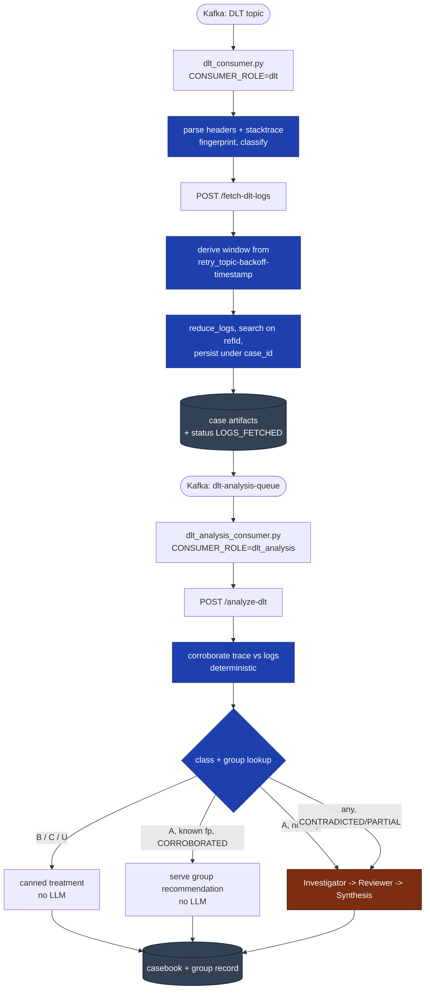

# Packet-CRM: Dead-Letter Topic (DLT) Analysis -- Engineering Design

Design date: 2026-08-18. Status: **Not started.** Phase 0 is a data-gathering
gate and must be run before Phase 4 goes anywhere near the packet path.

**How to use this document.** Sections 1-9 are the design. Section 10 is the
implementation plan, broken into self-contained phases. Each phase lists the
exact files it touches, the config it adds, its tests, its exit criteria, and
what is explicitly out of scope. Every phase leaves the test suite green, so
work can stop after any phase and resume later -- or in a fresh session --
without carrying context forward.

**Relationship to the rejection pipeline.** This is a **parallel flow**, not an
extension of the rejection flow. It shares the log pipeline
(`src/log_pipeline/`), the storage abstraction (`src/storage/`), the consumer
scaffolding (`src/utils/kafkaConsumer.py`), and the confidence policy
(`src/models/synthesis.py`). It does **not** share `MessagePayload`, the
rejection casebook schema, `rules.csv`, or the runbook key space. A rejection
and a stuck packet are different problems and are modelled separately.

---

## 1. Problem statement

Packets that fail processing are retried by Spring Kafka's `@RetryableTopic`
machinery and, after the configured attempts are exhausted, published to a
dead-letter topic. Today the triage process is manual: a developer opens the
DLT in Kafka UI, reads `kafka_exception-stacktrace` from the message headers,
and reasons about what went wrong from experience.

The volume is ~2,000 messages/day. No one reads 2,000 stack traces.

This system consumes that DLT, extracts and normalises the failure, classifies
it, corroborates the declared exception against the service's own logs, and
writes a casebook with a root-cause narrative, a recommendation, and a
confidence score. **It does not fix anything.** No replay, no redrive, no
mutation of any upstream system. The output is advisory and, for now, lands
only in casebook storage.

### 1.1 Why the stack trace alone is insufficient

Two reasons, and the second is the one that justifies the whole log lane:

1. **The trace names the failure site, not the cause.** `UidOriginTracker data
   not found` tells you a row was absent. It does not tell you whether the row
   was never written, written late, written under a different key, or deleted.
   With no source access and no database access (Section 2), the ceiling on
   this is a *per-code* answer, not a per-packet one. That is accepted --
   see 9.1.

2. **The declared exception may be a lie.** Application code catches a
   technical fault and rethrows it as a business exception. When that happens
   the trace confidently reports the wrong root cause, and every downstream
   consumer of that trace -- human or machine -- inherits the error. Logs from
   the same pod at the same instant are the only available check. **Surfacing
   that discrepancy is the highest-value output of this system**, because it is
   the one thing the developer reading Kafka UI structurally cannot see.

---

## 2. Non-goals

- **No remediation.** No replay, no redrive, no writes to any upstream service.
- **No source-code analysis.** `com.uidai.enu.biometric` is not accessible.
  Class B failures (Section 4) are enriched and routed, never diagnosed.
- **No database access.** We cannot confirm why a row is missing, only that the
  code said it was.
- **No production routing in v1.** Output goes to casebook storage. Jira/Slack/
  email integration is out of scope.
- **No automatic serving of unreviewed recommendations.** Until a human review
  mechanism exists, every recommendation is a draft (Section 7.4).
- **No multi-schema payload support in v1.** One payload schema is assumed;
  the extractor is built to be configurable so adding a second is config, not
  code (Section 5.3).

---

## 3. Established facts

These come from a real DLT header sample and from operator answers. Everything
in the design rests on them; if one turns out to be wrong, the phase that
depends on it is where it will surface.

| Fact | Value | Source |
|---|---|---|
| DLT producer | Spring Kafka `DeadLetterPublishingRecoverer` + `@RetryableTopic` | header shape |
| Topics consumed | One, for now | operator |
| Service | `enu-biometric`, namespace `ankalan` | operator |
| Retry-topic consumers | Same pods as the original consumer | operator |
| Log correlation id | `refId` (the same identifier this project already calls `event_id`) | operator |
| Payload schema | `EventMessage`, named by the `__TypeId__` header; single schema for now | operator |
| Registry | BusinessException code -> one-line description | operator |
| Volume | ~2,000 messages/day | operator |
| Source access | None | operator |
| Database access | None | operator |
| Output destination | Casebook storage only; testing phase | operator |
| Confidence score | Required, same shape as the rejection pipeline | operator |

### 3.1 The header contract

From the reference sample. Header names are Spring constants and are stable.

| Header | Example | Use |
|---|---|---|
| `kafka_original-topic` | `ENU.UPDATE.CHECKER.COMPLETION.V1` | case id, routing |
| `kafka_original-partition` | `63` | case id |
| `kafka_original-offset` | `3352` | case id, idempotency |
| `kafka_original-timestamp` | `1786864805192` (epoch ms) | original produce time |
| `kafka_dlt-original-consumer-group` | `enu-biodedup-cg` | service identity |
| `kafka_exception-fqcn` | `ListenerExecutionFailedException` | **ignore** -- Spring wrapper |
| `kafka_exception-cause-fqcn` | `java.lang.RuntimeException` | **ignore** -- see 3.2 |
| `kafka_exception-message` | `Listener failed; ...BusinessException: [CODE] ...` | fallback root extraction |
| `kafka_exception-stacktrace` | full `Caused by:` chain | **primary source** |
| `retry_topic-attempts` | `5` | attempt count |
| `retry_topic-original-timestamp` | `01A009712548` (hex epoch ms) | equals `kafka_original-timestamp` |
| `retry_topic-backoff-timestamp` | `01A012AB41BF` (hex epoch ms) | **last attempt time -- log window anchor** |
| `__TypeId__` | `com.uidai.enu.common.model.EventMessage` | payload schema selection |
| `event-source` | `scanner` | ignored (operator: meaningless) |

**The `retry_topic-*` timestamps are hex-encoded epoch milliseconds.** Verified
against the sample: `int("01A009712548", 16) == 1786864805192`, byte-identical
to `kafka_original-timestamp`, and `int("01A012AB41BF", 16)` decodes to
`2026-08-18T02:20:08.511Z`, which matches the `TimestampedException` timestamp
embedded in the trace text to the millisecond.

### 3.2 Two traps that will silently destroy the system

**Trap 1: fingerprinting on the exception headers.** In the sample,
`kafka_exception-fqcn` is `ListenerExecutionFailedException` and
`kafka_exception-cause-fqcn` is `java.lang.RuntimeException`. Both are Spring/
JDK wrappers that will be *identical for every failure in every Spring Kafka
consumer in the organisation*. Keying on them collapses the entire DLT into one
group. The root cause is the **last** `Caused by:` in the stacktrace text, four
levels down in the sample:

```
ListenerExecutionFailedException
  -> TimestampedException
    -> ListenerExecutionFailedException
      -> RuntimeException
        -> BusinessException: [UID_ORIGIN_TRACKER_DATA_NOT_FOUND]   <-- this one
```

**Trap 2: anchoring the log window on `kafka_original-timestamp`.** In the
sample the original message was produced at `2026-08-16T07:20:05Z` and the
final attempt failed at `2026-08-18T02:20:08Z` -- **43.0 hours apart**. Pod logs
for the original produce time are long gone. The window must be anchored on
`retry_topic-backoff-timestamp`. With the current `K8S_DEFAULT_SINCE_HOURS=2`
default and the wrong anchor, every fetch returns nothing.

---

## 4. Failure taxonomy

Classification is deterministic and happens before any LLM call. It decides
how much effort a message is worth.

| Class | Definition | Treatment | LLM? |
|---|---|---|---|
| **A** | Root exception is a `BusinessException` carrying a `[CODE]` | Registry lookup + log corroboration + recommendation | Yes, on novel fingerprints |
| **B** | Root is a code defect: `NullPointerException`, `IndexOutOfBoundsException`, `ClassCastException`, `NumberFormatException`, ... | Enrich, group, `NEEDS_MANUAL_REVIEW`. No diagnosis attempted -- no source access | No |
| **C** | Root is technical/transient: timeouts, connection resets, serialization, broker faults | Recommendation is always "redrive after the dependency recovers" | No |
| **U** | Unclassifiable -- trace unparseable, truncated, or root unrecognised | `NEEDS_MANUAL_REVIEW`, trace attached verbatim | No |

Class B is deliberately cheap. The operator's instruction was "just forward to
the dev team with whatever info we have." The value added over Kafka UI is not
diagnosis -- it is **aggregation**: this is occurrence 47 of this fingerprint,
first seen 2026-08-12, here are the affected refIds, here is the normalised
frame list. That is worth building and costs no tokens.

Class membership is derived from the root exception FQCN via a configurable
map (`DLT_CLASS_MAP`), defaulting to a table shipped in code. An unrecognised
FQCN is Class U, never silently Class B.

---

## 5. Component design

### 5.1 Stacktrace parsing and fingerprinting

The load-bearing component. Everything else -- caching, grouping, cost control
-- depends on the fingerprint being stable across occurrences and distinct
across genuinely different bugs.

**Parsing.** Split the stacktrace text on `\nCaused by: ` into an ordered chain.
Each link yields an exception FQCN, a message, and a frame list. The last link
is the root. `... N more` markers terminate a link's frames and are discarded.

**Frame normalisation.** A raw frame is
`at com.uidai.enu.biometric.service.impl.BioDeDuplicationServiceImpl.filterCandidatesAndBuildRefIdUidMap(BioDeDuplicationServiceImpl.java:4067)`.
Normalisation applies, in order:

1. **Keep only application frames** -- those whose FQCN starts with a prefix in
   `DLT_APP_PACKAGES` (default `com.uidai.,in.gov.uidai.`). Framework and JDK
   frames (`org.springframework.`, `java.base/`, `jdk.internal.`) are dropped.
   The sample's 4-level chain contains 60+ frames and 9 application ones.
2. **Drop line numbers.** `BioDeDuplicationServiceImpl` is a 4,000+ line class;
   line numbers shift on every release and would fragment a fingerprint that
   should be stable.
3. **Drop synthetic frames.** `GeneratedMethodAccessor781` (the counter varies
   per JVM run), `$$SpringCGLIB$$0`, `<generated>`, `$$Lambda$1234/0x00007f...`.
   All present in the sample. Left in, they guarantee that no two occurrences
   ever fingerprint alike.
4. **Drop exception plumbing** listed in `DLT_BOILERPLATE_FRAMES`. Added
   during Phase 1 after running against the reference sample: the top
   application frame of a `BusinessException` is
   `CommonErrorFactory.instantiateException`, because that factory constructs
   every business exception in the codebase. It is therefore identical across
   all Class A failures -- it contributes nothing to the fingerprint, displaces
   a frame that would, and makes the signature name the factory instead of the
   code that failed. Inferred from one sample; Phase 0's corpus should confirm
   it and reveal any siblings. Setting the variable empty disables the filter.
5. **Truncate to `DLT_FINGERPRINT_FRAMES`** (default 5) from the top.

**Fingerprint.**

```
sha256(root_fqcn + "|" + business_code_or_empty + "|" + "\n".join(normalised_frames))
```

Stored alongside a human-readable `signature` string so an operator can read a
group without decoding a hash.

**Version dimension.** The deployed build is not available in the headers
(Open Question 3). Until it is, the fingerprint carries no version, and a
fingerprint whose underlying bug has been fixed will keep matching. Mitigated
by recording `first_seen`/`last_seen` on the group so a stale group is visible;
see Risk R4.

### 5.2 Log window derivation

```
last_attempt   = hex_epoch_ms(retry_topic-backoff-timestamp)
                 or kafka_original-timestamp if the header is absent/unparseable
window_start   = last_attempt - DLT_LOG_LEAD_SECONDS      (default 300)
window_end     = last_attempt + DLT_LOG_TRAIL_SECONDS     (default 120)
```

The Kubernetes source takes `since_seconds` relative to *now*, so the fetch
passes `TimeWindow(seconds = now - window_start)` and the trailing bound is
applied during filtering. When `now - window_start` exceeds
`DLT_MAX_LOG_AGE_SECONDS` (default 86400) the fetch is skipped entirely and the
case is recorded `UNVERIFIABLE` with a `LOGS_TOO_OLD` gap, rather than burning
a fetch that is certain to return nothing.

Identifier matched against log lines: **`refId`**, not the case id. This
requires a small change to `reduce_logs` -- see 5.5.

### 5.3 Payload identifier extraction

`refId` lives inside the `EventMessage` payload; its exact path is Open
Question 1. The extractor is built as:

1. A configurable dotted path, `DLT_REFID_PATH` (e.g. `packetMetaData.refId`).
2. On miss, a bounded recursive search of the payload for keys in
   `DLT_REFID_KEYS` (default `refId,ref_id,referenceId`), depth-capped.
3. On miss, the case is still processed -- header-only. Logs are skipped and
   corroboration is `UNVERIFIABLE`.

Getting the path wrong is a config change, not a code change. Phase 0 supplies
the real path.

### 5.4 Case identity and idempotency

```
case_id = f"dlt-{original_topic}-{partition}-{offset}"
```

`(topic, partition, offset)` is the only naturally unique, naturally idempotent
key available. It survives redrive: if a developer replays from the DLT after a
fix, the same message produces the same case id and is skipped by the existing
terminal-status check. `refId` is *not* used as the case id -- one packet can
fail at several stages and produce several distinct DLT messages.

The generated id must satisfy `EVENT_ID_PATTERN`
(`^[A-Za-z0-9_.:-]{1,128}$`) in `src/models/schemas.py`. Topic names contain
dots and uppercase, both permitted. Any character outside the class is replaced
with `-`, and the id is truncated to 128 with a hash suffix if a topic name is
pathologically long.

### 5.5 Reuse of the log pipeline

`reduce_logs(event_id, extra_identifiers)` currently uses one identifier for
both *searching* and *persisting*. The DLT path needs them separate: search on
`refId`, persist under `case_id`.

Minimal change: add an optional `storage_key: Optional[str] = None` parameter,
defaulting to `event_id`, used only for artifact persistence. Every existing
caller is unaffected. Also add an optional `window: Optional[TimeWindow] = None`
so the DLT path can supply the derived window instead of
`K8S_DEFAULT_SINCE_HOURS`.

`K8S_SERVICE_MAP` gets one entry mapping consumer group `enu-biodedup-cg` to
namespace `ankalan` / app `enu-biometric`. Because the retry-topic consumers
run in the same pods (Section 3), no separate discovery is needed.

### 5.6 Corroboration -- deterministic, before the LLM

Takes the parsed trace and the fetched logs and returns one of:

| Verdict | Condition |
|---|---|
| `CORROBORATED` | An ERROR line for this `refId` within the window names the same root exception FQCN (or its business code) |
| `CONTRADICTED` | An ERROR line within the window names a *different* exception FQCN, and the trace's declared root does not appear anywhere in the window |
| `PARTIAL` | The declared root appears, but so do unexplained ERROR lines from other FQCNs |
| `UNVERIFIABLE` | No logs fetched, `refId` unknown, window too old, or no ERROR lines matched |

`CONTRADICTED` and `PARTIAL` are the mis-cast detector. They do not assert a
verdict on their own -- they escalate to the LLM lane with the discrepancy as
the framing question, and the resulting casebook leads with it.

**No real example of a mis-cast case exists yet** (Open Question 2). The check
is therefore built to *surface* discrepancies for a human rather than to
adjudicate them, and its thresholds are configuration. Phase 0 should try to
find one; if it cannot, the check ships conservative and is tightened later.

### 5.7 Group store and recommendation reuse

A **group** is the durable record for one fingerprint:

```
{
  "fingerprint": "<sha256>",
  "signature": "BusinessException[UID_ORIGIN_TRACKER_DATA_NOT_FOUND] @ BioDataBaseHelperServiceImpl.getUidOriginTrackerData",
  "failure_class": "A",
  "business_code": "UID_ORIGIN_TRACKER_DATA_NOT_FOUND",
  "first_seen": "...", "last_seen": "...", "occurrence_count": 47,
  "members": ["dlt-...-63-3352", ...],          // capped, see below
  "recommendation": { ... } | null,
  "recommendation_state": "none|draft|final",
  "corroboration_history": {"CORROBORATED": 44, "PARTIAL": 2, "CONTRADICTED": 1}
}
```

`members` is capped at `DLT_GROUP_MEMBER_CAP` (default 200) keeping the newest;
the full count lives in `occurrence_count`. At 2,000 messages/day an uncapped
list would grow without bound.

**Reuse policy -- the operative decision.** Never serve a cached recommendation
blind. Every message gets its logs fetched and its corroboration run; only the
*LLM* is skipped:

| Situation | Action |
|---|---|
| Novel fingerprint | Full LLM lane; write group with `recommendation_state: draft` |
| Known fingerprint, `CORROBORATED` | Serve the group's recommendation. No LLM call. Confidence carried from the group, minus a reuse decay |
| Known fingerprint, `PARTIAL`/`CONTRADICTED` | Full LLM lane. The discrepancy leads the casebook. Group's `corroboration_history` updated |
| Known fingerprint, `UNVERIFIABLE` | Serve the recommendation, capped at `DLT_UNVERIFIED_CONFIDENCE_CEILING` |
| Class B/C, any | Never calls the LLM; the group's canned treatment applies |

This is what makes 2,000/day affordable: logs are fetched in the fast stage and
are cheap; the LLM runs only on novel fingerprints and on discrepancies.
Expected steady-state LLM volume is tens of runs per day, not thousands. It
also keeps the mis-cast detector live on **every** message, which blind cache
reuse would have disabled.

### 5.8 Confidence policy

Reuses `apply_confidence_policy` in `src/models/synthesis.py`, extended with
DLT-specific ceilings applied *after* the model's own score:

| Condition | Ceiling |
|---|---|
| Class B (no source access) | Hard `NEEDS_MANUAL_REVIEW`, confidence never above `DLT_CLASS_B_CEILING` (0.3) |
| Class U | Same as Class B |
| `UNVERIFIABLE` corroboration | `DLT_UNVERIFIED_CONFIDENCE_CEILING` (0.5) |
| `CONTRADICTED` | `DLT_CONTRADICTED_CEILING` (0.6) -- we know the trace is wrong, not what is right |
| Registry miss on a Class A code | `DLT_REGISTRY_MISS_CEILING` (0.5) |
| Evidence gap banner present | existing `SYNTHESIS_GAP_CONFIDENCE_CEILING` (0.6) |
| Reused recommendation | group confidence x `DLT_REUSE_DECAY` (0.95) |

Ceilings compose by taking the minimum.

---

## 6. Architecture

Mirrors the existing two-stage split, for the same reason: a backlog in the LLM
stage must never stall log collection while pod logs rotate away.



### 6.1 Consumer role seam

`src/utils/kafkaConsumer.py` resolves topic/group/endpoint/timeout/heartbeat
from `CONSUMER_ROLE` at import time and is otherwise role-agnostic. Two things
block reuse as-is:

1. **Headers are discarded.** `_handle_one_message` reads only `msg.value`
   (`kafkaConsumer.py:388`). The DLT flow's primary evidence is in
   `msg.headers`.
2. **Validation and dedupe are `MessagePayload`-shaped.** The DLT payload is an
   `EventMessage` and would fail validation outright; the dedupe key is
   `eventId`, which does not exist here.

The fix is a **message adapter** protocol selected by role. Each adapter
implements:

```python
class MessageAdapter(Protocol):
    def case_id(self, msg) -> str: ...
    def validate(self, msg) -> tuple[bool, Optional[dict], Optional[str]]: ...
    def should_skip(self, case_id: str, parsed: dict) -> Optional[str]: ...
    def request_body(self, msg, parsed: dict) -> dict: ...
```

The existing fast/slow behaviour moves into a `RejectionAdapter` verbatim --
same `MessagePayload` validation, same `packetStatus == REJECTED` filter, same
terminal-casebook dedupe -- so the rejection path is provably unchanged. All
offset tracking, the rebalance listener, the semaphore, heartbeats, and the
shutdown drain are untouched and shared.

---

## 7. Storage layout

Separate root from the rejection casebooks, sharing the `CasebookStorage`
protocol and both backends.

```
<storage_root>/
  dlt_cases/
    dlt-ENU.UPDATE.CHECKER.COMPLETION.V1-63-3352/
      casebook.json          # the finding
      status.json            # LOGS_FETCHED -> terminal
      headers.json           # verbatim DLT headers, audit
      trace.txt              # verbatim stacktrace
      parsed_trace.json      # exception chain, frames, fingerprint
      raw_logs.txt           # existing pipeline artifacts
      reduced_logs.txt
  dlt_groups/
    <fingerprint>.json       # the group record from 5.7
```

`headers.json` and `trace.txt` are stored verbatim and **before** analysis, so
a parser bug is always recoverable without re-consuming Kafka. Both pass
through `src/log_pipeline/redaction.py` first -- a stacktrace message can carry
a UID.

### 7.1 Casebook schema

Deliberately not the rejection casebook. Fields:

```
schema_version, case_id, detected_at
source: {original_topic, partition, offset, consumer_group, attempts,
         original_timestamp, last_attempt_timestamp, type_id}
packet: {ref_id, ...any other extracted identifiers}
failure: {class, root_fqcn, business_code, registry_description,
          signature, fingerprint, chain: [...]}
evidence: {corroboration, log_window, gaps: [...], log_artifact_locators}
finding: {narrative, discrepancy | null, recommendation, action}
confidence: {score, ceilings_applied: [...], abstained}
provenance: {source: agent|group_reuse|canned, group_fingerprint,
             prompt_fingerprint, recommendation_state}
```

`action` vocabulary for this flow (not the rejection one):
`NEEDS_MANUAL_REVIEW`, `ROUTE_TO_DEV`, `REDRIVE_AFTER_RECOVERY`,
`DATA_FIX_REQUIRED`, `NO_ACTION`.

---

## 8. Configuration reference

All new. Added to `.env.example` in the phase that first reads them.

| Variable | Default | Meaning |
|---|---|---|
| `DLT_CONSUMER_TOPIC_NAME` | `packet-dlt` | Topic the DLT consumer reads |
| `DLT_CONSUMER_GROUP_ID` | `dlt-analysis-group` | Dedicated consumer group |
| `DLT_CONSUMER_ENDPOINT` | `http://localhost:8000/fetch-dlt-logs` | Fast-stage endpoint |
| `DLT_CONSUMER_TIMEOUT_SECONDS` | `90` | Fast-stage HTTP budget |
| `DLT_ANALYSIS_TOPIC_NAME` | `dlt-analysis-queue` | Second-stage topic |
| `DLT_ANALYSIS_GROUP_ID` | `dlt-analysis-slow-group` | Second-stage group |
| `DLT_ANALYSIS_ENDPOINT` | `http://localhost:8000/analyze-dlt` | Second-stage endpoint |
| `DLT_ANALYSIS_TIMEOUT_SECONDS` | `300` | LLM budget |
| `DLT_APP_PACKAGES` | `com.uidai.,in.gov.uidai.` | Frames kept during normalisation |
| `DLT_FINGERPRINT_FRAMES` | `5` | Frames in the fingerprint |
| `DLT_BOILERPLATE_FRAMES` | `in.gov.uidai.common.factory.CommonErrorFactory` | Exception-plumbing frames dropped before fingerprinting (5.1). Empty disables |
| `DLT_CLASS_MAP` | (built-in) | JSON, exception FQCN prefix -> class. **Extends** the built-in map, never replaces it |
| `DLT_BUSINESS_EXCEPTIONS` | `in.gov.uidai.common.exception.BusinessException` | Extra business-exception FQCNs; any `*BusinessException` already qualifies |
| `DLT_REFID_PATH` | (unset) | Dotted path to refId in the payload |
| `DLT_REFID_KEYS` | `refId,ref_id,referenceId` | Recursive-search fallback keys |
| `DLT_REGISTRY_PATH` | `business_errors.csv` | BusinessException registry |
| `DLT_LOG_LEAD_SECONDS` | `300` | Window before last attempt |
| `DLT_LOG_TRAIL_SECONDS` | `120` | Window after last attempt |
| `DLT_MAX_LOG_AGE_SECONDS` | `86400` | Skip the fetch beyond this age |
| `DLT_GROUP_MEMBER_CAP` | `200` | Members retained per group |
| `DLT_REUSE_ENABLED` | `true` | Master switch for recommendation reuse |
| `DLT_CLASS_B_CEILING` | `0.3` | Confidence ceiling, Class B/U |
| `DLT_UNVERIFIED_CONFIDENCE_CEILING` | `0.5` | Ceiling when corroboration is UNVERIFIABLE |
| `DLT_CONTRADICTED_CEILING` | `0.6` | Ceiling when the trace is contradicted |
| `DLT_REGISTRY_MISS_CEILING` | `0.5` | Ceiling when a Class A code is unknown |
| `DLT_REUSE_DECAY` | `0.95` | Multiplier on a reused confidence |
| `DLT_HEALTH_PORT` / `DLT_ANALYSIS_HEALTH_PORT` | (unset) | Per-role health servers |

---

## 9. Accepted tradeoffs

1. **Per-code answers, not per-packet.** Without source or database access, two
   packets with the same business code get the same narrative. This is a
   runbook, and it is what the available evidence supports. Stated plainly in
   every casebook so no reader mistakes it for a per-packet diagnosis.
2. **Class B adds aggregation, not diagnosis.** Accepted per operator
   direction.
3. **Line numbers are excluded from the fingerprint.** Two genuinely different
   bugs in the same method will merge. Judged the lesser evil against
   fragmenting every group on each release.
4. **No deploy-version dimension.** See Risk R4.
5. **The corroboration check ships without a validating example.** See Open
   Question 2.

---

## 10. Implementation phases

Each phase is self-contained, leaves the suite green, and can be completed in
one working session. **Do not start a phase before its predecessor's exit
criteria are met.**

Phases 1-3 and 6-7 are pure logic with no I/O and no wiring -- they can be
built and fully tested against fixtures without a cluster, a broker, or the
registry. Nothing touches the running packet path until Phase 4, and no LLM is
called until Phase 8.

### Status

| Phase | State | Notes |
|---|---|---|
| 0 | **Tooling ready, awaiting data** | `src/tools/dlt_sample.py` built and tested; the reference sample is committed as a fixture. Must be run against the live DLT from a host with broker access; results go in Section 11. |
| 1 | **Complete** | `src/dlt/headers.py`, `src/dlt/stacktrace.py`. 39 tests, including both trap regressions. Boilerplate-frame filter added during the phase -- see 5.1 step 4. |
| 2 | **Complete** | `src/dlt/classify.py`, `src/dlt/registry.py`, fixture registry CSV. 36 tests. `dlt_sample.py` gained `--analyze`, which computes the Section 11 measurements from a captured corpus. |
| 3 | **Complete** | `src/dlt/payload.py`, `src/dlt/identity.py`, `src/models/dlt_schemas.py`. 41 tests. Case-id sanitisation asserts the real invariant (no path separator), not the stricter one -- see the note in `test_path_traversal_cannot_survive_sanitisation`. |
| 4 | Not started | |
| 5 | Not started | |
| 6 | Not started | |
| 7 | Not started | |
| 8 | Not started | |
| 9 | Not started | |

---

### Phase 0 -- Sample capture and decision gate

**Goal.** Replace the assumptions in Section 3 with measurements. No production
code.

- **Deliverable:** `tests/fixtures/dlt/` containing 50-100 real DLT messages
  captured verbatim (headers + payload), redacted. Plus a findings section
  appended to this document (Section 11) reporting:
  1. Class distribution -- what share is A / B / C / U?
  2. Distinct fingerprint count over the sample, and the count for the top 5
     fingerprints. Validates the caching premise.
  3. Is `kafka_exception-stacktrace` ever **truncated**? Check for messages
     that do not terminate in a complete frame list.
  4. **The `refId` path inside `EventMessage`** -- exact dotted path.
  5. **Do `enu-biometric` pod log lines carry `refId`?** Pull `kubectl logs`
     for one known failure and confirm the log pattern includes it (MDC). If
     not, the log lane cannot filter and Phase 5 must be redesigned.
  6. Whether any message shows a mis-cast exception (Open Question 2).
  7. Observed lag between `retry_topic-backoff-timestamp` and DLT arrival.
- **Tooling:** `src/tools/dlt_sample.py`, built in this phase. Capture with
  `--limit`/`--redact` (needs broker access); then `--analyze <dir>` computes
  items 1, 2, 3, 4 and 7 above and writes `_analysis.json` (needs no broker,
  so the two halves can run on different hosts). Item 5 is still a manual
  `kubectl logs` check.
- **Exit criteria:** items 1-5 answered and recorded in Section 11. Item 5 is a
  hard gate on Phase 5.
- **Out of scope:** everything else.

---

### Phase 1 -- Header and stacktrace parsing

**Goal.** Turn a raw DLT message into a structured, fingerprinted failure. Pure
functions, no I/O.

- **New:** `src/dlt/__init__.py`; `src/dlt/headers.py` (header extraction, hex
  epoch decoding, `DltHeaders` dataclass); `src/dlt/stacktrace.py` (`Caused by:`
  chain parsing, frame normalisation, fingerprinting).
- **Config:** `DLT_APP_PACKAGES`, `DLT_FINGERPRINT_FRAMES`.
- **Tests:** `tests/test_dlt_stacktrace.py`, using the reference sample in this
  document as a fixture:
  - The root of the reference chain is `BusinessException`, **not**
    `RuntimeException` -- a direct regression guard on Trap 1 (3.2).
  - `int("01A009712548", 16) == 1786864805192`, equal to
    `kafka_original-timestamp`.
  - `retry_topic-backoff-timestamp` decodes to `2026-08-18T02:20:08.511Z`.
  - Normalisation removes `GeneratedMethodAccessor781`, `$$SpringCGLIB$$0`,
    `<generated>`, and all `org.springframework.`/`java.base/` frames, leaving
    only `com.uidai.`/`in.gov.uidai.` frames.
  - Two traces differing only in line numbers produce the **same** fingerprint.
  - Two traces with different root FQCNs produce **different** fingerprints.
  - A truncated trace (`Caused by:` with no frames) does not raise.
  - A stacktrace header that is absent entirely does not raise.
- **Exit criteria:** the reference sample fingerprints deterministically across
  runs and processes; all guards above green.
- **Out of scope:** classification, registry, any I/O, any wiring.

---

### Phase 2 -- Classification and the BusinessException registry

**Goal.** Assign a failure class and resolve a business code to its
description.

- **New:** `src/dlt/classify.py` (Class A/B/C/U from root FQCN + `[CODE]`
  extraction); `src/dlt/registry.py` (CSV loader, process-cached, code lookup).
- **Modified:** `.env.example`.
- **Config:** `DLT_CLASS_MAP`, `DLT_REGISTRY_PATH`.
- **Tests:** `tests/test_dlt_classify.py`:
  - The reference sample classifies as **A** with code
    `UID_ORIGIN_TRACKER_DATA_NOT_FOUND`.
  - A synthetic NPE classifies as **B**; a `SocketTimeoutException` as **C**;
    an unknown FQCN as **U**, never B.
  - Business code extraction handles `[CODE] message`, a message with no
    brackets, and brackets appearing later in the text.
  - A missing registry file is a miss, not a crash. An unknown code is a miss.
  - Registry lookup is case-exact and whitespace-trimmed.
- **Exit criteria:** classification is total (every input yields a class) and
  the registry degrades to "miss" on every failure mode.
- **Out of scope:** anything using the class to make a decision.

---

### Phase 3 -- Payload adapter and case identity

**Goal.** Extract `refId` from the payload and derive a valid, idempotent case
id.

- **New:** `src/dlt/payload.py` (configurable dotted path + bounded recursive
  fallback); `src/dlt/identity.py` (`case_id` derivation, `EVENT_ID_PATTERN`
  sanitisation and length capping); `src/models/dlt_schemas.py`
  (`DltMessage` Pydantic model -- headers + payload + parsed failure,
  `extra="allow"` on the payload).
- **Config:** `DLT_REFID_PATH`, `DLT_REFID_KEYS`.
- **Tests:** `tests/test_dlt_payload.py`:
  - Dotted path extraction, including a path that does not exist.
  - Recursive fallback finds `refId` at depth; respects the depth cap; returns
    `None` rather than raising when absent.
  - `case_id` for the reference sample is
    `dlt-ENU.UPDATE.CHECKER.COMPLETION.V1-63-3352` and matches
    `EVENT_ID_PATTERN`.
  - A topic name containing `/` or a space is sanitised and still matches the
    pattern.
  - A pathologically long topic name yields an id <= 128 chars, still unique.
  - The same `(topic, partition, offset)` always yields the same id.
- **Exit criteria:** every id produced from the Phase 0 fixture corpus
  validates against `EVENT_ID_PATTERN` and is unique per message.
- **Out of scope:** storage, consumers.

---

### Phase 4 -- Consumer role seam and the DLT consumer

**Goal.** Consume the DLT topic with headers intact, without changing rejection
behaviour. No fetching, no analysis -- parse, log, commit.

- **New:** `src/utils/message_adapters.py` (`MessageAdapter` protocol,
  `RejectionAdapter` -- today's logic moved verbatim -- and `DltAdapter`);
  `src/dlt_consumer.py` (entrypoint setting `CONSUMER_ROLE=dlt`).
- **Modified:** `src/utils/kafkaConsumer.py` -- add the `dlt` role branch;
  route validation/dedupe/body-construction through the role's adapter; pass
  `msg.headers` to the adapter (**this is the fix for `kafkaConsumer.py:388`,
  which discards them today**). `src/utils/paths.py` -- DLT heartbeat path.
  `start.py` -- supervise the new process. `.env.example`.
- **Config:** `DLT_CONSUMER_TOPIC_NAME`, `DLT_CONSUMER_GROUP_ID`,
  `DLT_CONSUMER_ENDPOINT`, `DLT_CONSUMER_TIMEOUT_SECONDS`, `DLT_HEALTH_PORT`.
- **Tests:** `tests/test_dlt_consumer.py` and additions to
  `tests/test_audit_phase1.py`:
  - **Rejection-path regression:** the existing fast and slow consumer tests
    pass unchanged. `RejectionAdapter` must be behaviourally identical --
    same `MessagePayload` validation, same `packetStatus == REJECTED` filter,
    same terminal-casebook dedupe, same poison-pill DLQ path.
  - Headers survive from `msg` to the outgoing request body, including a
    50KB stacktrace.
  - A header value that is `bytes` (kafka-python's native type) decodes; a
    non-UTF-8 header does not raise.
  - A message whose payload is unparseable JSON goes to the DLQ, offset
    commits.
  - A redelivered message with an existing terminal case is skipped and
    commits.
  - Offset semantics are unchanged: dispatch tracked, committed only on
    completion.
- **Exit criteria:** full existing suite green and unchanged. The DLT consumer
  runs against a fixture broker, parses every Phase 0 sample without raising,
  and commits.
- **Out of scope:** log fetching, the analysis queue, any LLM.

---

### Phase 5 -- Log window, fetch endpoint, analysis queue

**Goal.** Fetch the right logs for the right window and hand off to stage two.

**Gated on Phase 0 item 5** -- if pod log lines do not carry `refId`, stop and
redesign.

- **New:** `src/dlt/window.py` (window derivation from
  `retry_topic-backoff-timestamp`, `DLT_MAX_LOG_AGE_SECONDS` skip);
  `src/api/dlt_routes.py` (`POST /fetch-dlt-logs`); `src/dlt/case_storage.py`
  (the `dlt_cases/` layout from Section 7, over `CasebookStorage`).
- **Modified:** `src/log_pipeline/pipeline.py` -- `reduce_logs` gains optional
  `storage_key` and `window` parameters, both defaulting to current behaviour
  (5.5). `src/utils/analysis_queue_publisher.py` -- publish to the DLT analysis
  topic. `src/api/routes.py` -- mount the new router. `.env.example`.
- **Config:** `DLT_LOG_LEAD_SECONDS`, `DLT_LOG_TRAIL_SECONDS`,
  `DLT_MAX_LOG_AGE_SECONDS`, `DLT_ANALYSIS_TOPIC_NAME`.
- **Tests:** `tests/test_dlt_window.py`, `tests/test_dlt_fetch_route.py`:
  - The reference sample's window anchors on `2026-08-18T02:20:08Z`, **not**
    `2026-08-16T07:20:05Z` -- a direct regression guard on Trap 2 (3.2), with
    the 43-hour gap asserted explicitly.
  - A missing/unparseable backoff header falls back to
    `kafka_original-timestamp`.
  - A window older than `DLT_MAX_LOG_AGE_SECONDS` skips the fetch and records
    a `LOGS_TOO_OLD` gap rather than fetching.
  - `reduce_logs` searches on `refId` and persists under `case_id`.
  - **Existing callers of `reduce_logs` are unaffected** -- the rejection
    pipeline's log tests pass unchanged.
  - `headers.json` and `trace.txt` are persisted **before** any analysis, and
    pass through redaction (a UID embedded in an exception message is scrubbed;
    the `refId` is allowlisted and survives).
  - A missing `refId` still produces a case, with logs skipped.
  - The endpoint is idempotent: a second call for the same case id reuses the
    persisted artifacts.
- **Exit criteria:** a Phase 0 sample flows end-to-end from topic to
  `dlt_cases/<case_id>/` with logs and a `LOGS_FETCHED` status, and lands on
  the analysis queue.
- **Out of scope:** corroboration, grouping, LLM.

---

### Phase 6 -- Corroboration

**Goal.** Compare the declared trace against the fetched logs. Deterministic,
no LLM.

- **New:** `src/dlt/corroborate.py` -- returns `CORROBORATED` / `PARTIAL` /
  `CONTRADICTED` / `UNVERIFIABLE` with the supporting log lines cited.
- **Tests:** `tests/test_dlt_corroborate.py`, all against synthetic log
  fixtures:
  - Logs containing the declared root FQCN -> `CORROBORATED`.
  - Logs containing the business code but not the FQCN -> `CORROBORATED`.
  - Logs containing **only** a different exception (a timeout) where the
    declared root is a `BusinessException` -> `CONTRADICTED`. **This is the
    mis-cast case and is the reason the log lane exists.**
  - Declared root present *plus* unexplained ERRORs -> `PARTIAL`.
  - Empty logs, no `refId`, or a `LOGS_TOO_OLD` gap -> `UNVERIFIABLE`.
  - "Could not look" (fetch failure) and "looked, found nothing" both map to
    `UNVERIFIABLE` and are distinguishable in the returned detail -- mirrors
    the `FetchResult.ok` distinction the log pipeline already makes.
  - Every verdict cites the specific log lines it relied on.
- **Exit criteria:** verdicts are stable and every one carries citations.
- **Out of scope:** acting on the verdict.

---

### Phase 7 -- Group store and reuse policy

**Goal.** Persist per-fingerprint groups and decide, deterministically, whether
a message needs the LLM.

- **New:** `src/dlt/groups.py` (group record read/write over `CasebookStorage`,
  member cap, occurrence counting, `corroboration_history`);
  `src/dlt/reuse.py` (the decision table from 5.7 as a pure function returning
  `LLM_REQUIRED` / `REUSE_GROUP` / `CANNED`).
- **Config:** `DLT_GROUP_MEMBER_CAP`, `DLT_REUSE_ENABLED`.
- **Tests:** `tests/test_dlt_groups.py`, `tests/test_dlt_reuse.py`:
  - Novel fingerprint -> `LLM_REQUIRED`, group created with
    `recommendation_state: none`.
  - Known fingerprint + `CORROBORATED` + a `draft`/`final` recommendation ->
    `REUSE_GROUP`.
  - Known fingerprint + `CONTRADICTED` -> `LLM_REQUIRED`, regardless of cache.
  - Known fingerprint + `PARTIAL` -> `LLM_REQUIRED`.
  - Class B/C -> `CANNED`, never `LLM_REQUIRED`, at any occurrence count.
  - `DLT_REUSE_ENABLED=false` forces `LLM_REQUIRED` for Class A.
  - Member list caps at `DLT_GROUP_MEMBER_CAP` keeping the newest;
    `occurrence_count` keeps counting past the cap.
  - Concurrent updates to one group from two workers do not lose an increment
    (file lock, as `pending_rules.jsonl` already does).
- **Exit criteria:** replaying the Phase 0 corpus produces a group count
  matching the Phase 0 measurement, and the implied LLM call count is
  materially below the message count -- **this is the number that proves the
  cost model.** Record it in Section 11.
- **Out of scope:** producing a recommendation.

---

### Phase 8 -- Analysis lane

**Goal.** Produce the finding. The only phase that calls an LLM.

- **New:** `src/prompts/DltInvestigatorAgent.md`, `DltReviewerAgent.md`,
  `DltSynthesisAgent.md`; `src/dlt/orchestrator.py` (LangGraph:
  investigate -> review -> synthesise, reusing the retry and synthesis-repair
  patterns in `src/core/agent_orchestrator.py`); `src/dlt/canned.py` (Class
  B/C/U treatments); `src/models/dlt_synthesis.py` (result schema + DLT
  confidence ceilings); `src/dlt_analysis_consumer.py` (entrypoint);
  `POST /analyze-dlt` in `src/api/dlt_routes.py`.
- **Modified:** `src/models/synthesis.py` -- extend `apply_confidence_policy`
  with the DLT ceilings (5.8), additive, rejection behaviour unchanged.
  `src/utils/kafkaConsumer.py` -- `dlt_analysis` role. `start.py`,
  `.env.example`.
- **Config:** `DLT_ANALYSIS_*`, all `DLT_*_CEILING`, `DLT_REUSE_DECAY`.
- **Prompt design notes:**
  - The Investigator's question is **not** "what went wrong" -- the trace
    already says. It is "does the log evidence support the trace's claim, and
    if not, what does it show instead?"
  - Registry descriptions are one line and may be incomplete. The prompt must
    treat the description as a seed, and must **never** invent detail about
    *why* a record is missing -- we have no database access. Abstaining is the
    correct answer for a per-packet cause.
  - Every claim cites a log line or a trace frame. The Reviewer rejects
    uncited claims, exactly as the rejection Reviewer does.
- **Tests:** `tests/test_dlt_analysis.py` with a mocked LLM:
  - Class B never invokes the LLM and always yields `NEEDS_MANUAL_REVIEW`
    with confidence <= `DLT_CLASS_B_CEILING`.
  - `REUSE_GROUP` never invokes the LLM; confidence carries the decay.
  - `CONTRADICTED` invokes the LLM and the resulting casebook's `discrepancy`
    field is populated and leads the narrative.
  - Confidence ceilings compose by minimum; each applied ceiling is named in
    `ceilings_applied`.
  - Malformed synthesis output triggers repair, then
    `FAILED_SYNTHESIS_PARSE` -- same contract as the rejection path.
  - Every recommendation is written `recommendation_state: draft`. **No path
    writes `final` in v1** (Section 2).
  - A rejection-path confidence test proves `apply_confidence_policy` is
    unchanged for non-DLT callers.
- **Exit criteria:** end-to-end from DLT topic to a casebook with a
  confidence score, against fixtures and a mocked LLM. Rejection suite green.
- **Out of scope:** promoting drafts; any external routing.

---

### Phase 9 -- Operator CLI and observability

**Goal.** Make the output usable and the system legible.

- **New:** `src/tools/dlt_report.py` -- `--top` (fingerprints by volume),
  `--group <fingerprint>` (inspect: signature, members, corroboration history,
  recommendation), `--case <case_id>` (full casebook + trace), `--unreviewed`
  (drafts awaiting review, the queue a human will eventually work).
- **Modified:** `src/utils/metrics.py` -- counters by class, corroboration
  verdict, reuse decision, group count, LLM invocations, registry misses;
  histogram of window age at fetch time. `src/api/routes.py` -- `/health` and
  `/ready` report the two new consumers' heartbeats alongside the existing two.
  `ARCHITECTURE.md` -- a DLT section cross-referencing this document.
- **Tests:** `tests/test_dlt_report.py` -- each subcommand against a fixture
  store; metrics increment on each path.
- **Exit criteria:** an operator can go from "what is failing most this week"
  to a specific trace in two commands.
- **Out of scope:** dashboards, alerting, the review/approval mechanism.

---

### Dependency graph

```
Phase 0 (data gate) ──────────────┐
                                  ├──> Phase 5 (hard gate: item 5)
Phase 1 ──> Phase 2 ──> Phase 3 ──┴──> Phase 4 ──> Phase 5 ──> Phase 6 ──> Phase 7 ──> Phase 8 ──> Phase 9
```

Phases 1-3 are pure logic and may be built in parallel with Phase 0's data
collection. Phase 4 must not merge before Phase 0 confirms the payload shape.

---

## 11. Phase 0 findings

*(Unfilled. Populate from Phase 0 before starting Phase 5.)*

### 11.1 Class distribution
### 11.2 Fingerprint cardinality
### 11.3 Stacktrace truncation
### 11.4 refId path in EventMessage
### 11.5 refId presence in pod log lines -- **hard gate on Phase 5**
### 11.6 Mis-cast examples found
### 11.7 DLT arrival lag
### 11.8 Measured LLM call reduction (from Phase 7)

---

## 12. Open questions

1. **Where is `refId` in the `EventMessage` payload?** Blocks nothing --
   `DLT_REFID_PATH` is config and the recursive fallback covers the common
   shapes -- but a wrong default means silently empty logs. Answered by Phase 0.
2. **Is there a real mis-cast example?** The corroboration check is designed
   against a hypothesis. Until one real case validates it, `CONTRADICTED`
   thresholds stay conservative and the verdict is advisory only.
3. **Is the deployed build version available anywhere** -- a header, a pod
   label, an image tag? Without it, a fingerprint cannot be retired when its
   bug is fixed. See Risk R4.
4. **What is the actual DLT topic name and the retry backoff configuration?**
   The 43-hour span in the sample is either a long configured backoff or
   consumer lag before the first attempt. If it is lag, the last attempt may be
   much older than assumed and `DLT_MAX_LOG_AGE_SECONDS` needs revisiting.
5. **Who works the draft queue?** There is no feedback loop -- output goes
   nowhere external. Until someone reviews drafts, a wrong recommendation on a
   novel fingerprint is served to every subsequent occurrence. Mitigated in v1
   by never writing `final`, so every reuse is explicitly marked unreviewed.

---

## 13. Risks

| # | Risk | Impact | Mitigation |
|---|---|---|---|
| R1 | Pod log lines do not carry `refId` | The log lane cannot filter; corroboration is permanently `UNVERIFIABLE` and the mis-cast detector never fires | Phase 0 item 5 is a hard gate on Phase 5 |
| R2 | Fingerprint over-groups (generic wrapper leaks through normalisation) | Distinct bugs share one recommendation; wrong advice at scale | Trap-1 regression test in Phase 1; Phase 7 exit criteria compares group count against the Phase 0 measurement |
| R3 | Fingerprint under-groups (a synthetic frame survives) | Cache never hits; LLM cost scales with the 2,000/day message rate | Phase 1 normalisation tests name every synthetic form seen in the sample; Phase 7 records the measured reduction |
| R4 | No deploy-version dimension | A fixed bug keeps serving its old recommendation indefinitely | `first_seen`/`last_seen` on the group make staleness visible; `dlt_report --top` surfaces it; revisit when Open Question 3 is answered |
| R5 | Stacktrace truncated in headers | The root `Caused by:` -- the only part that matters -- is exactly what is cut | Phase 0 item 3 measures it; parser degrades to Class U rather than fingerprinting a wrapper |
| R6 | 2,000/day overwhelms the fast stage | Log fetch backlog, pod logs rotate before capture | Same two-stage split that already protects the rejection path; fast stage is bounded I/O only; `MAX_CONCURRENT_INVESTIGATIONS` applies per role |
| R7 | Registry arrives in an unexpected format | Phase 2 loader mismatch | Loader is isolated in `src/dlt/registry.py` behind a single lookup function; a format change touches one file |
| R8 | Adapter refactor regresses the rejection path | Live pipeline breaks | `RejectionAdapter` moves today's logic verbatim; Phase 4 exit criteria requires the existing suite green and unchanged |
